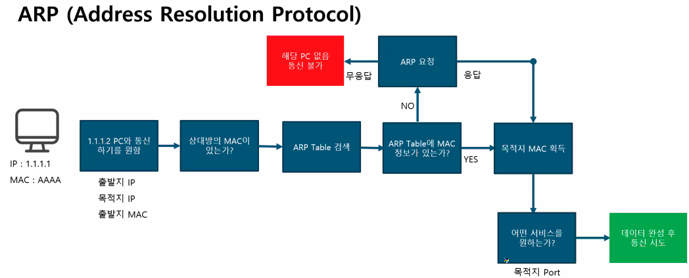

# 2025년 2월 4일 TIL

## 스크럼

- 학습 목표 1: 패킷트레이서 이해 및 설치
- 학습 목표 2: 위클리 챌린지 잘 해보기

## 새로 배운 내용

### 지난 시간 복습

#### Switch와 Router의 비교

#### ARP

배웠던 부분 중 가장 몰랐던 부분이었다.

#### 서브넷

### 패킷트레이서

아직 LAN 수준이지만 IP 대역대도 나눠 보고, 시뮬레이션을 통해 패킷의 이동을 관찰하는 것도 재밌었다.

IP를 직접 입력하는 것이 정말로 내키지 않아서 처음부터 DHCP를 배워서 적용했다.

## 오늘의 도전 과제와 해결 방법

* DHCP 적용

  IP 입력이 싫어서 했던 일이지만 중반엔 괜히 그랬나 했던 순간도 있었다.
  하지만 결과물을 놓고 보니 라우터 IP와 서브 인터페이스만 잘 설정해 두면 되는 일이었다.

## 오늘의 회고

##  참고 자료 및 링크